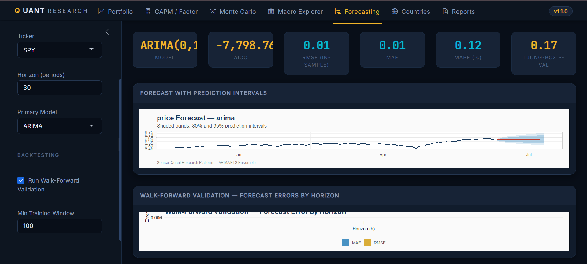

# Quant Research & Economic Intelligence Platform

<div align="center">

```
╔═══════════════════════════════════════════════════════════════════╗
║   QUANT RESEARCH & ECONOMIC INTELLIGENCE PLATFORM                ║
║   Institutional-Grade Analytics — Built Entirely in R            ║
╚═══════════════════════════════════════════════════════════════════╝
```

[](https://github.com/yourusername/quant-research-platform/actions)
[](LICENSE)
[](https://www.r-project.org/)
[](Dockerfile)
[](https://lintr.r-lib.org/)

**An open-source quantitative research platform combining portfolio analytics,
macroeconomic intelligence, statistical modelling, and automated reporting.**

[Features](#features) · [Architecture](#architecture) · [Quick Start](#quick-start) · [Documentation](#documentation) · [Dashboard](#dashboard) · [Roadmap](#roadmap)

</div>

---

## Vision

This platform is designed around a single premise: **rigorous quantitative research should be reproducible, auditable, and accessible.**

It is not a tutorial. It is not a dashboard collection. It is not a collection of scripts.

It is a **production-grade analytical system** built with the same engineering discipline expected of a quantitative research team at an asset manager or central bank — where every model carries mathematical justification, every function has a contract, and every result is reproducible.

---

## What This Platform Does

```
Data Ingestion ──► Validation ──► Analytics ──► Forecasting ──► Reporting
      │                                │               │
  Yahoo Finance               Portfolio Opt.        ARIMA / ETS
  FRED / World Bank           CAPM Analysis         GARCH Vol
  IMF Datasets                Monte Carlo           Ensemble Methods
  CSV / Local                 Risk Metrics          Walk-Forward CV
```

---

## Features

### Quantitative Analytics
- **Portfolio Optimisation**: Mean-Variance (Markowitz), Maximum Sharpe, Minimum Variance via Quadratic Programming
- **CAPM**: OLS-based alpha/beta decomposition, Treynor ratio, systematic vs idiosyncratic risk
- **Risk Metrics**: VaR (parametric + historical), Expected Shortfall (CVaR), Sharpe, Sortino, Calmar ratios
- **Factor Analysis**: Fama-French-style multi-factor decomposition
- **Drawdown Analysis**: Underwater curves, recovery time, Calmar ratio

### Econometrics
- **ARIMA**: Hyndman-Khandakar automatic order selection; Ljung-Box residual diagnostics
- **GARCH(p,q)**: Bollerslev (1986) volatility clustering model with student-t/GED innovations
- **OLS from first principles**: Manual matrix algebra (`β̂ = (X'X)⁻¹X'y`)
- **Regularised Regression**: Ridge, Lasso, Elastic Net with cross-validated λ
- **Diagnostics**: Breusch-Pagan, Durbin-Watson, Ramsey RESET, HAC-robust standard errors

### Monte Carlo Simulation
- **Geometric Brownian Motion** with Itô correction (`-σ²/2` drift adjustment)
- **Correlated Multi-Asset GBM** via Cholesky decomposition of the correlation matrix
- **Historical Bootstrap** (i.i.d. and block variants preserving autocorrelation)
- Fan charts, terminal distributions, VaR/ES computation from simulation paths

### Forecasting
- Multi-model ensemble (ARIMA, ETS, Holt-Winters, Naïve)
- Information-theoretic model weighting (`w ∝ exp(-0.5 × ΔAIC)`)
- Walk-forward (expanding-window) backtesting with MAE/RMSE/MAPE/MASE
- 80% and 95% prediction interval construction

### Data Infrastructure
- **Yahoo Finance**: OHLCV + adjusted prices via `quantmod`
- **FRED**: 20+ macroeconomic series (GDP, CPI, unemployment, yield curve, VIX)
- **World Bank**: 15+ development indicators for G20 countries
- Intelligent caching, validation, gap-filling, and outlier detection

### Visualization
- Institutional ggplot2 theme (Bloomberg/FT aesthetic)
- Interactive Plotly charts with dark terminal styling
- Correlation heatmaps, yield curves, efficient frontier, MC fan charts
- Publication-quality PNG/SVG at 300 DPI

### Automated Reporting
- RMarkdown/Quarto templates: Portfolio, Macro, Risk, Forecast, Full Platform
- HTML + PDF output with executive summaries
- Parameterised reports — generate any slice automatically

### Interactive Dashboard
- 6-tab Shiny application: Portfolio, CAPM, Monte Carlo, Macro Explorer, Forecasting, Reports
- Dark terminal aesthetic with institutional KPI panels
- Real-time data refresh + downloadable report generation

---

## Architecture

```
quant-research-platform/
│
├── R/                          # Core analytical modules (pure functions)
│   ├── ingestion/              # Data acquisition pipelines
│   │   ├── yahoo_finance.R     # OHLCV + adjusted prices; LOCF cache
│   │   ├── fred_api.R          # 20-series macro catalogue; yield curve
│   │   └── world_bank.R        # G20 development indicators via WDI
│   │
│   ├── cleaning/               # Data quality layer
│   │   ├── validate.R          # Schema validation: dates, OHLC logic, NA rates
│   │   └── clean_prices.R      # Outlier detection (MAD), gap-fill, alignment
│   │
│   ├── transformations/        # Portfolio mathematics
│   │   └── portfolio_analytics.R  # MVO, CAPM, Sharpe, Drawdown, Frontier
│   │
│   ├── econometrics/           # Statistical models
│   │   ├── time_series.R       # ADF/KPSS, ARIMA, GARCH, decomposition
│   │   └── regression.R        # OLS (matrix), HAC, Ridge/Lasso, diagnostics
│   │
│   ├── simulations/            # Stochastic engines
│   │   └── monte_carlo.R       # GBM, correlated GBM (Cholesky), bootstrap
│   │
│   ├── forecasting/            # Forecasting pipeline
│   │   └── forecast_pipeline.R # Ensemble, walk-forward backtesting
│   │
│   ├── visualization/          # Chart library
│   │   ├── theme.R             # Institutional ggplot2 theme + palettes
│   │   └── charts.R            # 15+ chart functions (NAV, DD, corr, MC, yield)
│   │
│   ├── reporting/              # Report generation utilities
│   └── utilities/              # Config, logging, helpers
│       ├── config.R            # YAML config loader + singleton
│       ├── logger.R            # Structured levelled logging
│       └── helpers.R           # Pure financial math helpers
│
├── shiny-dashboard/            # Interactive web application
│   ├── global.R                # Package loading, platform initialisation
│   ├── ui.R                    # bslib dark terminal UI (6 tabs)
│   └── server.R                # Reactive logic, data flows, plot rendering
│
├── models/                     # Saved model artefacts
│   ├── regression/
│   ├── volatility/             # Fitted GARCH models
│   ├── time-series/            # Fitted ARIMA models
│   ├── forecasting/
│   └── monte-carlo/
│
├── reports/                    # Report templates and outputs
│   ├── automated/              # Parameterised RMarkdown templates
│   ├── html/                   # Rendered HTML reports
│   └── pdf/                    # Rendered PDF reports
│
├── data/
│   ├── raw/                    # Cached API responses (gitignored)
│   ├── processed/              # Cleaned, validated datasets
│   ├── external/               # Third-party datasets
│   └── simulated/              # Monte Carlo path outputs
│
├── tests/testthat/             # Unit test suite (50+ tests)
│   ├── test-helpers.R          # Financial math correctness
│   ├── test-portfolio.R        # Portfolio analytics & optimisation
│   ├── test-monte-carlo.R      # GBM statistical properties
│   └── test-econometrics.R     # ARIMA, OLS, ADF test validation
│
├── docs/                       # Documentation
│   ├── methodology/            # Statistical methodology papers
│   ├── api/                    # Function documentation
│   └── architecture/           # System design notes
│
├── .github/workflows/ci.yml    # CI: lint → test → docker → render report
├── config/settings.yml         # Platform-wide configuration
├── DESCRIPTION                 # R package metadata
├── Dockerfile                  # rocker/tidyverse containerisation
├── renv.lock                   # Exact package versions (reproducibility)
└── .lintr                      # Code style enforcement
```

---

## Quick Start

### Prerequisites
- R ≥ 4.3.0
- RStudio (recommended) or any R IDE
- Git

### 1. Clone

```bash
git clone https://github.com/yourusername/quant-research-platform.git
cd quant-research-platform
```

### 2. Install Dependencies via renv

```r
install.packages("renv")
renv::restore()   # installs exact package versions from renv.lock
```

### 3. Configure (Optional)

Edit `config/settings.yml` or set environment variables:

```bash
export FRED_API_KEY="your_fred_api_key_here"   # free at fred.stlouisfed.org
```

### 4. Run the Dashboard

```r
shiny::runApp("shiny-dashboard")
```

### 5. Run a Portfolio Analysis

```r
library(here)
source(here("R", "utilities", "config.R"))
source(here("R", "ingestion",  "yahoo_finance.R"))
source(here("R", "transformations", "portfolio_analytics.R"))
source(here("R", "visualization", "charts.R"))

cfg <- get_config()

# Fetch 3 years of adjusted prices for 5 ETFs
prices <- fetch_adjusted_prices(
  tickers = c("SPY", "AGG", "GLD", "QQQ", "TLT"),
  from    = Sys.Date() - 365 * 3,
  cfg     = cfg
)

# Compute returns and portfolio statistics (equal-weight)
returns  <- compute_returns_pipeline(
  tidyr::pivot_longer(prices, -date, names_to = "ticker", values_to = "adjusted")
)
returns_wide <- tidyr::pivot_wider(returns, names_from = ticker, values_from = return)

weights  <- setNames(rep(0.2, 5), c("SPY","AGG","GLD","QQQ","TLT"))
port     <- portfolio_statistics(returns_wide, weights)

cat(sprintf("Sharpe Ratio:  %.3f\n", port$stats["sharpe_ratio"]))
cat(sprintf("Max Drawdown:  %.2f%%\n", port$stats["max_drawdown"] * 100))
cat(sprintf("Ann. Return:   %.2f%%\n", port$stats["ann_return"] * 100))
```

### 6. Run Monte Carlo Simulation

```r
source(here("R", "simulations", "monte_carlo.R"))

paths   <- simulate_gbm(S0 = 100, mu = 0.10, sigma = 0.20,
                         T_days = 252, n_paths = 10000)
summary <- summarise_mc_paths(paths, S0 = 100)

cat(sprintf("P(Loss):  %.1f%%\n", summary$prob_loss * 100))
cat(sprintf("VaR 95%%: %.1f%%\n", summary$var_95 * 100))
cat(sprintf("ES  95%%: %.1f%%\n", summary$es_95  * 100))

chart_mc_paths(paths, S0 = 100, ticker = "Portfolio")
```

### 7. Run Tests

```r
library(testthat)
testthat::test_dir("tests/testthat/")
```

### 8. Docker (fully reproducible)

```bash
docker build -t quant-platform .
docker run -p 3838:3838 quant-platform
# Open http://localhost:3838
```

---

## Mathematical Foundations

This platform is built on transparent, derivable mathematics — not opaque library calls.

### Geometric Brownian Motion

$$dS_t = \mu S_t \, dt + \sigma S_t \, dW_t$$

Exact discretisation (Itô's lemma):

$$S_{t+\Delta t} = S_t \exp\!\left[\left(\mu - \frac{\sigma^2}{2}\right)\Delta t + \sigma\sqrt{\Delta t}\, Z_t\right], \quad Z_t \sim \mathcal{N}(0,1)$$

The $-\sigma^2/2$ term is the **Itô correction** — it ensures $\mathbb{E}[\log S_T] = (\mu - \sigma^2/2)T$, not $\mu T$.

### Portfolio Variance (Markowitz)

$$\sigma_p^2 = \mathbf{w}^\top \boldsymbol{\Sigma} \mathbf{w}$$

Minimum Variance Portfolio (unconstrained):

$$\mathbf{w}^* = \frac{\boldsymbol{\Sigma}^{-1}\mathbf{1}}{\mathbf{1}^\top \boldsymbol{\Sigma}^{-1}\mathbf{1}}$$

### CAPM

$$r_{i,t} - r_{f,t} = \alpha_i + \beta_i(r_{m,t} - r_{f,t}) + \varepsilon_{i,t}$$

Estimated via OLS: $\hat{\boldsymbol{\beta}} = (\mathbf{X}^\top\mathbf{X})^{-1}\mathbf{X}^\top\mathbf{y}$

### Expected Shortfall (Parametric)

$$\text{ES}_\alpha = -\left(\mu - \sigma \frac{\phi(z_\alpha)}{\alpha}\right)$$

where $\phi$ is the standard normal PDF. ES is a **coherent** risk measure (VaR is not).

### GARCH(1,1)

$$\sigma_t^2 = \omega + \alpha \varepsilon_{t-1}^2 + \beta \sigma_{t-1}^2, \quad \alpha + \beta < 1$$

Long-run variance: $\bar{\sigma}^2 = \omega / (1 - \alpha - \beta)$

---

## Dashboard Preview

<div align="center">



</div>

---

## Engineering Standards

| Standard           | Implementation                            |
|--------------------|-------------------------------------------|
| Reproducibility    | `renv.lock` pins all package versions     |
| Testing            | `testthat` — 50+ unit tests               |
| Code style         | `lintr` with snake_case enforcement       |
| Logging            | Structured `logger` with levels + file    |
| Configuration      | YAML-based, env-var overrides             |
| Containerisation   | Dockerfile on `rocker/tidyverse:4.4.1`    |
| CI/CD              | GitHub Actions: lint → test → docker      |
| Documentation      | Roxygen2 inline docs on all exported fns  |
| Error handling     | `tryCatch` at all external API boundaries |
| Data validation    | Schema-based validation before analytics  |

---

## Commit Strategy

This repository uses **Conventional Commits** for a clean, readable history:

```
feat(portfolio): add minimum variance portfolio with QP solver
fix(garch): correct long-run variance formula ω/(1-α-β)
perf(monte-carlo): vectorise GBM path generation (5x speedup)
test(capm): add test verifying beta recovery from synthetic data
docs(readme): add mathematical foundations section
refactor(ingestion): extract xts_to_tibble into standalone helper
ci: add R 4.3.3 to test matrix for version compatibility
```

**Branch strategy:**
- `main` — production-stable, tagged releases only
- `develop` — integration branch, weekly merges to main
- `feat/*` — feature branches, squash-merged to develop
- `fix/*` — hotfix branches, cherry-picked to main if critical

**Release versioning:** Semantic Versioning (SemVer) — `MAJOR.MINOR.PATCH`

---

## Roadmap

### v1.1 — Macro Integration
- [ ] IMF World Economic Outlook dataset ingestion
- [ ] Macro regime detection (Hidden Markov Model)
- [ ] Cross-country economic comparison dashboard

### v1.2 — Advanced Risk Models
- [ ] Copula-based dependence modelling
- [ ] Stress testing framework (2008, COVID-19 scenarios)
- [ ] Dynamic Conditional Correlation (DCC-GARCH)
- [ ] Factor risk model (Barra-style)

### v1.3 — ML Integration
- [ ] Random Forest return forecasting
- [ ] LSTM for volatility prediction
- [ ] Explainability via SHAP values

### v2.0 — Production Infrastructure
- [ ] PostgreSQL time-series database backend
- [ ] REST API via Plumber
- [ ] Scheduled data refresh (cron jobs)
- [ ] Multi-user authentication

---

## Documentation

| Document                               | Description                                        |
|----------------------------------------|----------------------------------------------------|
| [Architecture](docs/architecture/)     | System design, data flow, module dependencies      |
| [Methodology](docs/methodology/)       | Statistical and mathematical background            |
| [API Reference](docs/api/)             | All exported function signatures and examples      |
| [CONTRIBUTING](CONTRIBUTING.md)        | Development setup, PR process, code standards      |

---

## Technical Stack

| Layer            | Technology                                    |
|------------------|-----------------------------------------------|
| Language         | R 4.4.1                                       |
| Data Ingestion   | quantmod, fredr, WDI                          |
| Econometrics     | forecast, rugarch, tseries, sandwich, glmnet  |
| Visualisation    | ggplot2, plotly, scales                       |
| Dashboard        | shiny, bslib, DT, shinyjs                     |
| Reporting        | rmarkdown, knitr, kableExtra                  |
| Engineering      | renv, testthat, lintr, logger, here, yaml     |
| Containerisation | Docker (rocker/tidyverse:4.4.1)               |
| CI/CD            | GitHub Actions                                |

---

## Why This Project Stands Apart

Most GitHub portfolios show: a downloaded Kaggle dataset, a few ggplot charts, a logistic regression, and a deployed Streamlit app.

This platform demonstrates something qualitatively different:

1. **Mathematical transparency** — formulas are derived and explained, not just called from libraries
2. **Engineering rigour** — modular architecture, typed contracts, tested with statistical correctness tests
3. **Institutional thinking** — the design reflects how quant teams actually structure research infrastructure
4. **Reproducibility** — any result can be reproduced exactly via `renv::restore()` + seed management
5. **Depth over breadth** — GARCH volatility clustering is not just called — it is explained, fitted, diagnosed, and forecast with uncertainty

---

## For Recruiters & Interviewers

**What this demonstrates:**

- Ability to implement financial mathematics correctly (not just call packages)
- Software architecture skills: modularity, separation of concerns, dependency inversion
- Production mindset: logging, validation, error handling, CI/CD, containerisation
- Statistical maturity: understanding assumptions, limitations, and when models break
- Communication: clear documentation, reproducible research

**Interview talking points:**

- *"Walk me through your Monte Carlo implementation."* → Discuss GBM SDE, Itô correction, Cholesky for correlation
- *"How does your CAPM test know beta is correct?"* → Discuss synthetic data with known DGP, comparison to true value
- *"Why GARCH over simple rolling volatility?"* → Discuss volatility clustering, ARCH effects, MLE estimation, persistence
- *"What's the difference between VaR and ES, and why does it matter?"* → Discuss coherence, tail risk, Basel III requirements

---

## License

MIT — See [LICENSE](LICENSE) for details.

---

<div align="center">

*Built with rigour. Designed to last.*

</div>
